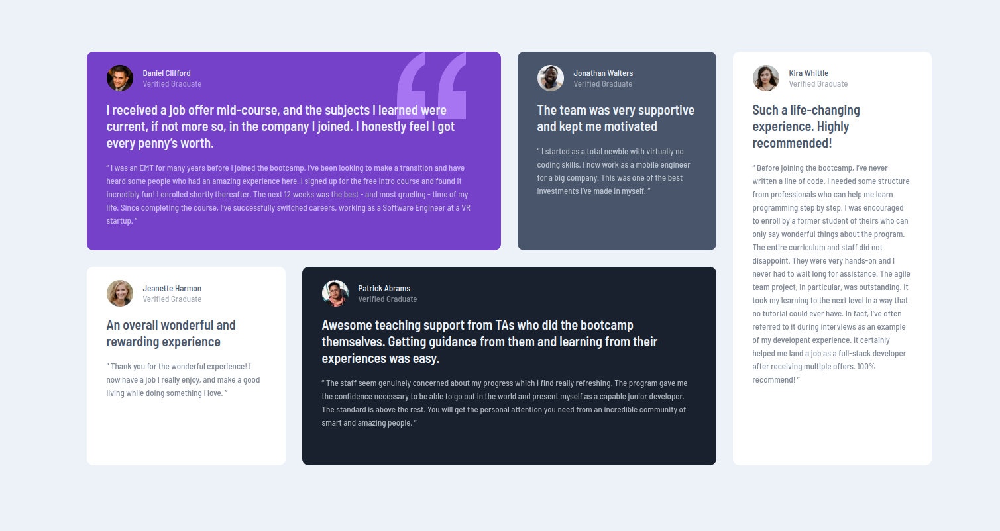
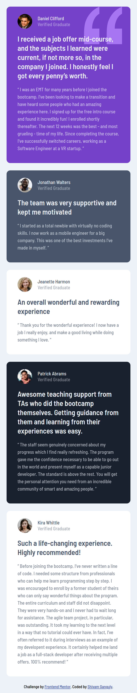

# Frontend Mentor - Testimonials grid section solution

This is a solution to the [Testimonials grid section challenge on Frontend Mentor](https://www.frontendmentor.io/challenges/testimonials-grid-section-Nnw6J7Un7). Frontend Mentor challenges help you improve your coding skills by building realistic projects.

## Table of contents

- [Overview](#overview)
  - [The challenge](#the-challenge)
  - [Screenshot](#screenshot)
  - [Links](#links)
- [My process](#my-process)
  - [Built with](#built-with)
  - [What I learned](#what-i-learned)
  - [Continued development](#continued-development)
- [Author](#author)
- [Acknowledgments](#acknowledgments)

## Overview

### The challenge

Users should be able to:

- View the optimal layout for the site depending on their device's screen size

### Screenshot





### Links

- Solution URL: [GitHub](https://github.com/MonarchRyuzaki/Testimonials-Grid-Section)
- Live Site URL: [Live Here!!](https://monarchryuzaki.github.io/Testimonials-Grid-Section/)

## My process

### Built with

- Semantic HTML5 markup
- CSS custom properties
- Flexbox
- CSS Grid
- Mobile-first workflow

### What I learned

This challenge was a lot of Fun. I learnt CSS Grid while doing this. It was a lot of fun. It had a mix of Grid and Flexbox plus the Mobile First Workflow and a lottttt of funn :)

```css
.testimonials{
        display: grid;
        grid-template-columns: 300px 300px 300px 300px;
        grid-template-rows: 300px 300px;
        align-items: stretch;
        gap: 25px;
    }
    .card{
        margin: 0;
        max-width: none;
    }
    .card2{
        grid-area: 1 / 1 / 2 / 3;
    }
    .card3{
        grid-area: 1 / 3 / 2 / 4;
    }
    .card4{
        grid-area: 2 / 1 / 3 / 2;
    }
    .card5{
        grid-area: 2 / 2 / 3 / 4;
    }
    .card6{
        grid-area: 1 / 4 / 3 / 5;
    }
```

### Continued development

Get More Experience with CSS Grid, Positioning Things and the Mobile First Workflow

## Author

* LinkedIn - [Shivam Ganguly](https://www.linkedin.com/in/shivam-ganguly-357b90255/)
* Frontend Mentor - [@MonarchRyuzaki](https://www.frontendmentor.io/profile/MonarchRyuzaki)

## Acknowledgments

Special Thanks to [Colt Steele](https://www.udemy.com/user/coltsteele/) for his [Web Development Bootcamp](https://www.udemy.com/course/the-web-developer-bootcamp/).
